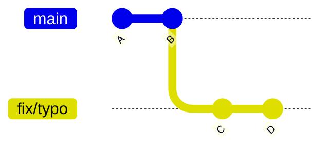
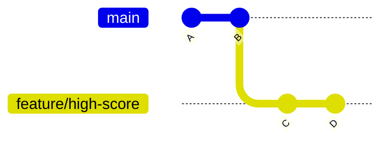
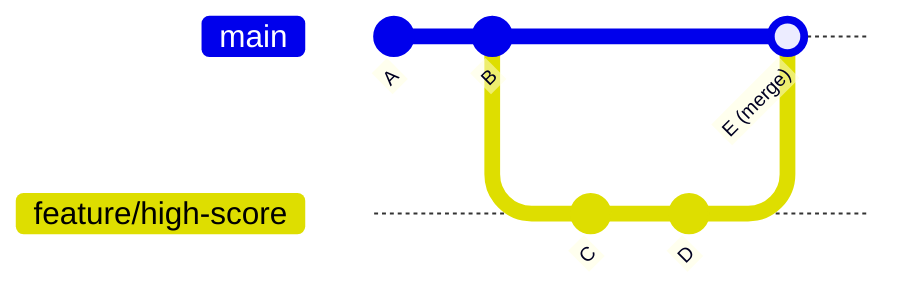
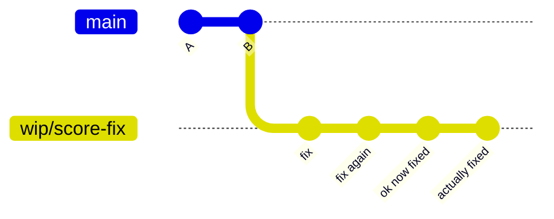
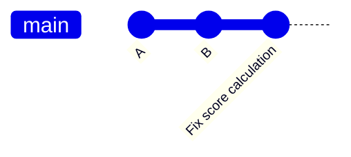

# m06-merging

There's more than one way to merge — here's when to use each.

Most people learn `git merge` and assume that's it. But Git gives you three distinct strategies, and picking the wrong one leaves you with a history that's either cluttered, misleading, or missing context you'll want later. This module covers all three, when each one makes sense, and how to actually see the difference.

---

## The three merge types

### 1. Fast-forward (FF)

The simplest case. If `main` hasn't moved since you branched off it, Git doesn't need to create a new commit — it just slides the branch commits directly onto `main`. The history stays perfectly linear, as if the branch never existed.

**Before:**



**After `git merge fix/typo`:**


The branch pointer is gone. Commits C and D are now just part of `main`. Clean, linear, no noise.

**When to use it:** Small fixes, personal branches, anything where the branch context isn't worth preserving. If you're the only one who touched it and the commits are self-explanatory, FF is fine.

**The flag:** `git merge --ff-only` — this tells Git to only proceed if a fast-forward is possible. If `main` has moved on, it refuses instead of silently creating a merge commit. Useful as a safety check.

---

### 2. Merge commit (`--no-ff`)

Forces Git to create a new merge commit even when a fast-forward would be possible. The branch stays visible in the history graph as a parallel line that converges back into `main`.

**Before:**



**After `git merge --no-ff feature/high-score -m "Add high score tracking"`:**



The branch is preserved in the graph. You can see exactly which commits belonged to that feature, when it was merged, and by whom.

**When to use it:** Any feature branch worth remembering. Team workflows. Anything where "what was this branch for?" is a question someone might ask in six months. The merge commit itself is a good place to write a summary of what the feature did.

**The flag:** `git merge --no-ff <branch> -m "your message"` — always write a meaningful message here, not just "Merge branch 'feature/x'".

---

### 3. Squash merge

Takes all the commits on your branch and collapses them into a single new commit on `main`. The individual commits disappear — only the squashed result lands in the history.

**Before:**



**After `git merge --squash wip/score-fix` + commit:**



Four messy commits become one clean one. The branch is gone from the graph entirely.

**When to use it:** WIP branches where you committed frequently just to save progress. Branches with commit messages like "fix", "fix2", "typo", "ugh". Any time the individual commits don't tell a useful story and you'd rather write one clean summary.

**The catch:** You lose the individual commit detail permanently. If you ever need to understand *how* the fix evolved step by step, it's gone. That's usually fine for small fixes — less fine for complex features.

**The flag:** `git merge --squash <branch>` — note that this stages the changes but does **not** auto-commit. You have to run `git commit -m "your message"` yourself. That's intentional — it forces you to write a good summary.

---

## Lab

You'll create one branch, make three small commits, then merge it three different ways and compare the `git log --graph` output each time.

### Setup

Make sure you're in `sandbox/stack-overflown/` on `main` with a clean working tree:

```bash
cd sandbox/stack-overflown
git status
git log --oneline
```

### Step 1: Create a branch and make 3 commits

```bash
git checkout -b practice/merge-types
```

**Commit 1 — add a comment to `index.js`:**

Open `index.js` and add a comment above the `init` function:

```js
// Initialize the game board and start the game loop
function init() {
```

```bash
git add index.js
git commit -m "Add comment above init function"
```

**Commit 2 — fix a label typo in `index.html`:**

Open `index.html` and change `"Soft Drop"` to `"Soft drop"` (lowercase d):

```bash
git add index.html
git commit -m "Fix capitalisation in controls label"
```

**Commit 3 — rename a variable in `index.js`:**

Open `index.js` and find `dropCounter`. Rename it to `dropTimer` in the two places it appears (the declaration and the increment):

```bash
git add index.js
git commit -m "Rename dropCounter to dropTimer for clarity"
```

Check your branch has 3 commits ahead of `main`:

```bash
git log --all --graph --oneline
```

### Step 2: Merge with fast-forward

Switch to `main`:

```bash
git checkout main
```

Merge using fast-forward only:

```bash
git merge --ff-only practice/merge-types
```

Check the graph:

```bash
git log --all --graph --oneline
```

Notice: perfectly linear. The three commits are now directly on `main`. No merge commit, no branch line.

Delete the branch label:

```bash
git branch --delete practice/merge-types
```

### Step 3: Reset and try no-ff

Reset `main` back 3 commits to undo the merge:

```bash
git reset --hard HEAD~3
```

Recreate the branch from the commits you just reset (they're still in the repo):

```bash
git checkout -b practice/merge-types
git add index.js index.html
```

Actually, easier — just redo the three commits on a fresh branch:

```bash
git reset --hard HEAD   # clean state
```

Repeat the three commits from Step 1 on the branch, then:

```bash
git checkout main
git merge --no-ff practice/merge-types -m "Practice branch: comments, typo fix, rename"
```

Check the graph:

```bash
git log --all --graph --oneline
```

Notice: the branch line is visible. You can see the three commits as a parallel track that merges back in. The merge commit E ties them together.

Delete the branch:

```bash
git branch --delete practice/merge-types
```

### Step 4: Reset and try squash

Reset `main` back again:

```bash
git reset --hard HEAD~4
```

Redo the three commits on a fresh branch (same as before), then:

```bash
git checkout main
git merge --squash practice/merge-types
```

Git stages everything but doesn't commit. Write a clean summary:

```bash
git commit -m "Clean up init comment, label typo, and variable name"
```

Check the graph:

```bash
git log --all --graph --oneline
```

Notice: one commit. The three individual commits are gone. The branch line never appears. From `main`'s perspective, this was a single change.

### Comparing the three

| Strategy | Commits in history | Branch visible in graph | When to use |
|---|---|---|---|
| `--ff-only` | 3 (inline) | No | Small, clean, personal fixes |
| `--no-ff` | 3 + 1 merge commit | Yes | Features worth tracing |
| `--squash` | 1 | No | Messy WIP you want to summarise |

---

## When to use what

| Situation | Merge type |
|---|---|
| Small personal fix, no one else cares about the branch | Fast-forward |
| Bug fix that's one or two clean commits | Fast-forward |
| Feature branch with meaningful commit history | `--no-ff` merge commit |
| Team workflow where branch traceability matters | `--no-ff` merge commit |
| WIP branch with commits like "fix", "fix again", "ugh" | Squash |
| Messy commits you want to hide behind one clean message | Squash |
| You want to enforce FF-only and fail loudly if it's not possible | `--ff-only` |

The honest answer: most teams pick one default (usually `--no-ff` for features, squash for small fixes) and stick to it. Consistency matters more than picking the "right" one.

---

## Challenge

You have a branch with 5 ugly commits: `"fix"`, `"fix again"`, `"ok now fixed"`, `"actually fixed"`, `"done for real"`. Merge it into `main` so the history looks clean — one line in `git log`, a message that actually describes what was fixed, and no trace of the five individual commits.

Create the branch yourself with dummy commits to simulate it, then merge it the right way. When you're done, `git log --oneline` should show exactly one new commit on `main`. Go.

---

## What's next

→ [m07-conflicts](../m07-conflicts/README.md) — what happens when two branches edit the same line, and how to fix it without panicking.

---

**Difficulty:** 🟡 Beginner-Intermediate | **Est. time:** 30 min | **Prerequisites:** [m05-branching](../m05-branching/README.md)
